# Enclosure for 3d printer based on Ikea Melltorp tables

Thing tracker at:
https://cscott.github.io/thing-tracker/#/thing/6400396d-9777-424c-8209-8ab2d352c14b

## Description

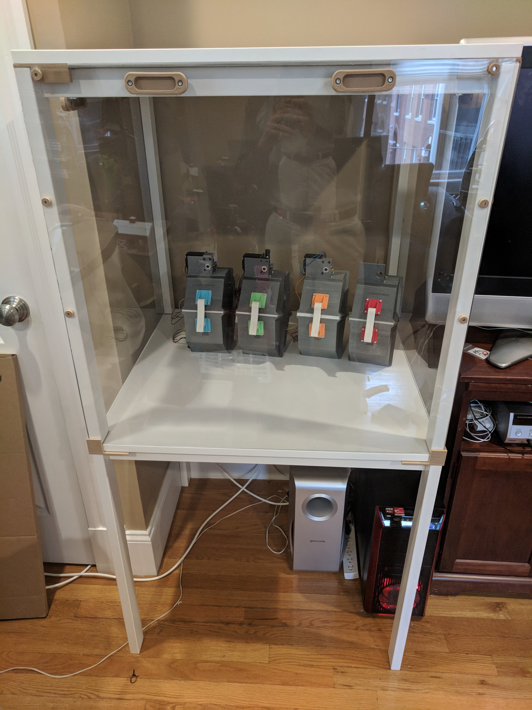

This repository contains a collection of parts used to create a 29.5"
x 29.5" 3D printer enclosure based on IKEA [Melltorp] tables.  It was
inspired by the many similar designs for enclosures based on the IKEA
[Lack] tables, but my modified Printrbot Simple Metal printer is a bit
too large to fit in the 22" x 22" space provided by the Lack.

You will need two Melltorp tables.  You could probably stack these
three high if you wanted an enclosure for two printers.

 

## Instructions

### Step 1: Assemble bottom table.

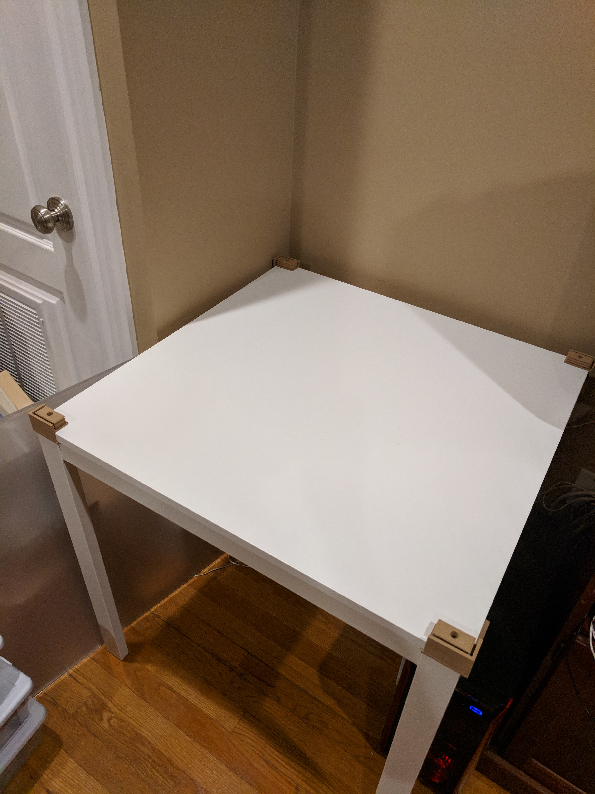

Follow the Ikea instructions for assembling the bottom table.  After
assembly, flip the table upright and unscrew the four allen-head bolts
attaching the tabletop to the leg assembly.  Slide four printer leg
holder pieces ([`melltorp-above-wrap.stl`]) over the corners of the
table, inserting the white Ikea spacers into the cutouts provided,
then reattach the tabletop using the allen-head bolts.

 
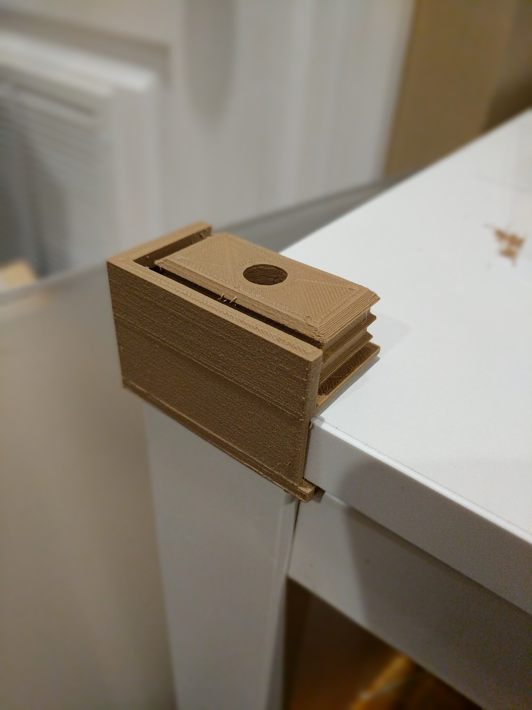

Alternatively, you could use [`melltorp-above.stl`] and screw the leg
holders directly into the table top.

 

### Step 2: Assemble top table.

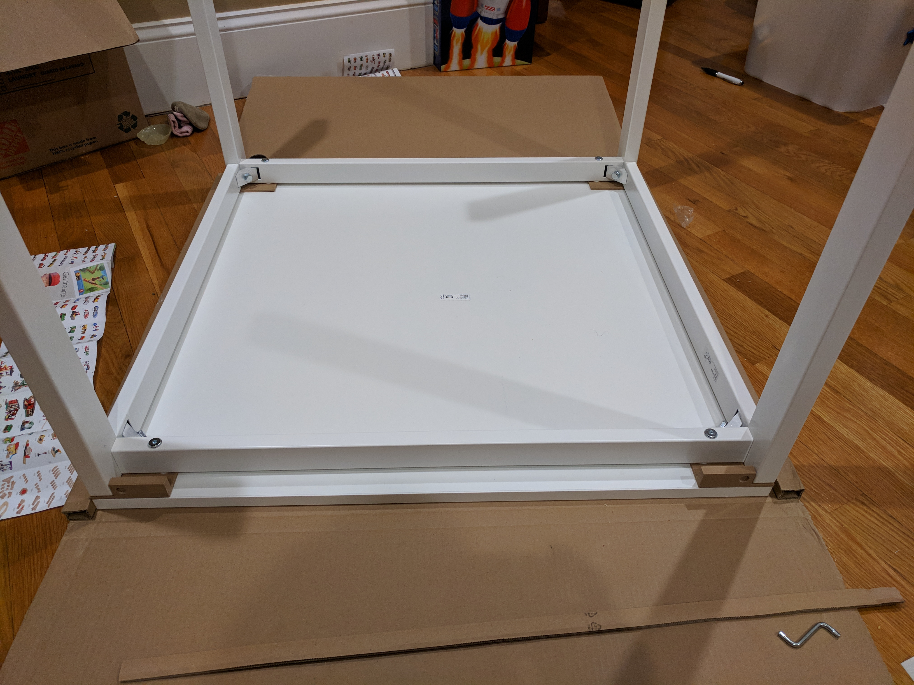

Again, follow the Ikea instructions to assemble the top table, but
sandwich the four magnet holders ([`melltorp-below.stl`]) between the
legs and tabletop, using the white Ikea spacers in the provided
cutouts for alignment. I also recommend using [foam sealing tape]
between the table frame and table top to seal the gap.

 
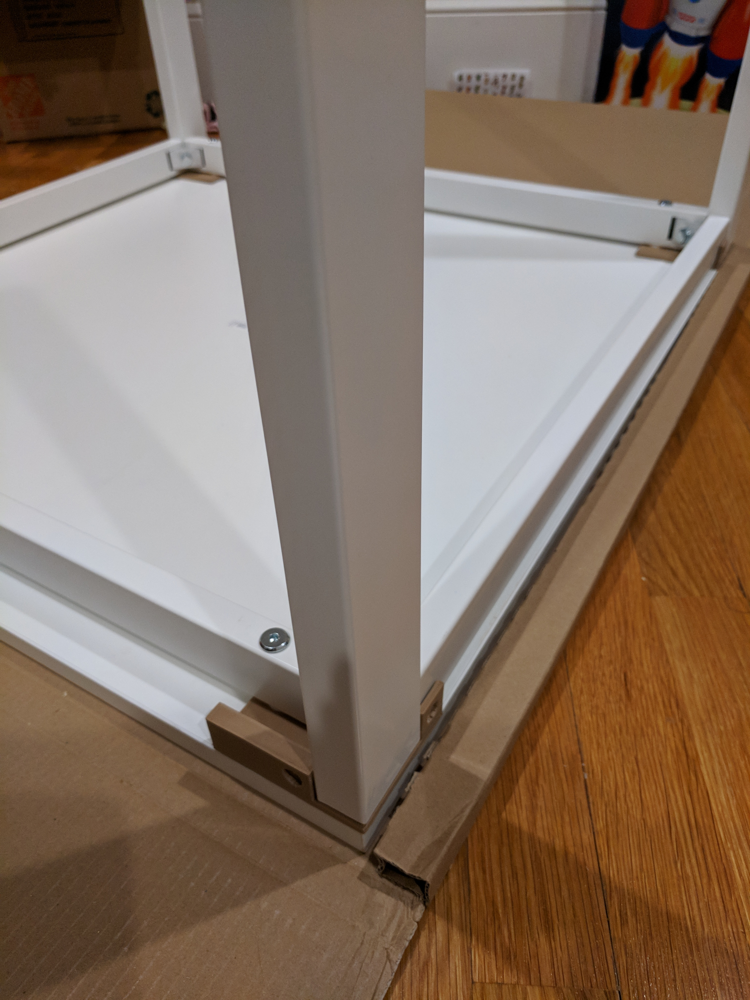

 

### Step 3: Stack the tables

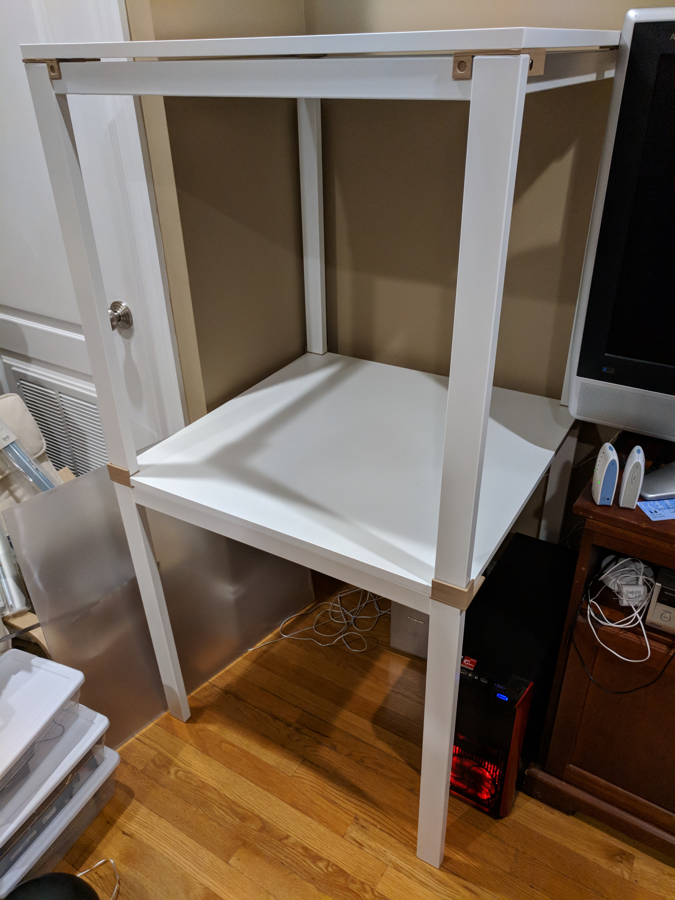

Pry off the white plastic caps on the end of each leg on the top
table, then stack the top table on top of the bottom table.

 

### Step 4: Trim plexiglass

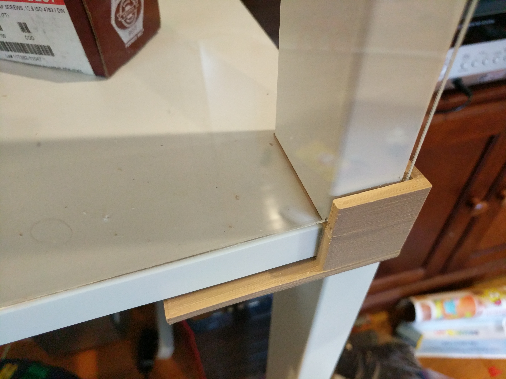

Trim 4 sheets of [28"x30" plexiglass] to 28" x 29.25".  (Note that the
link goes to Lowe's, which sells "30in x 30in" sheets of plexiglass
which are really 28" x 30".  If you get your plexiglass from a
different source, you might want to extend the 28" side up to 28.5"
for a better seal.)

The bottom of the plexiglass will slide into the space between the
table legs and the leg holder.

 

### Step 5: Install magnets

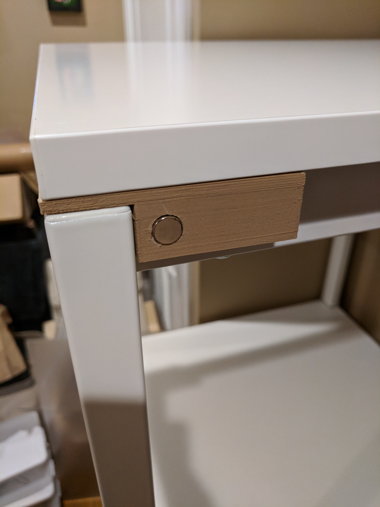

Insert magnets into the indents by the table legs.  Take care to
ensure the polarities of the magnets are consistent.

 
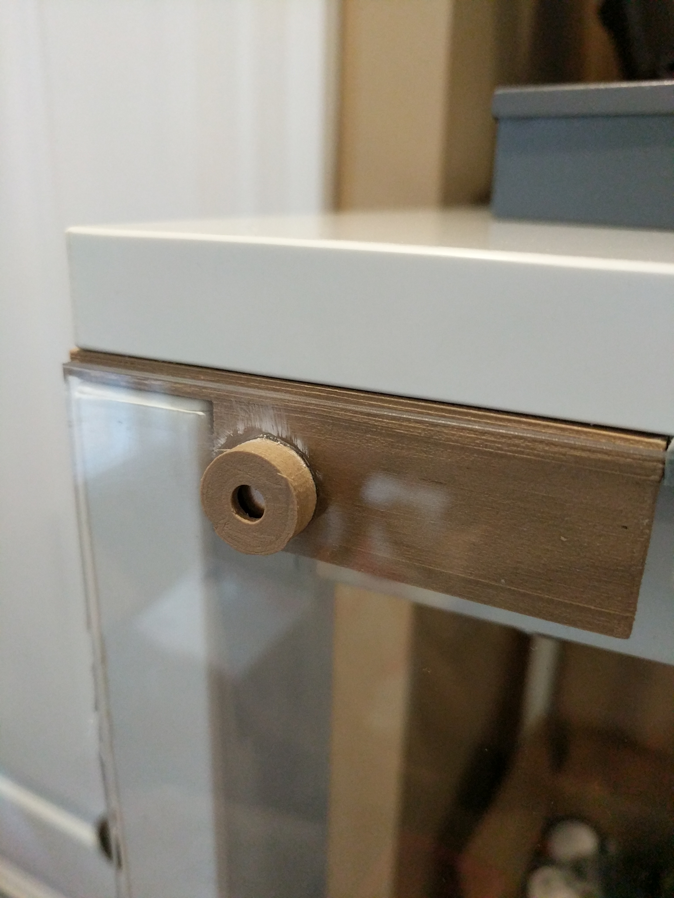

Now insert
magnets into the magnet mount rings ([`melltorp-holder.stl`]), again
taking care to ensure that the polarity is consistent and that the
open end of the mount ring is attracted to the open side of the table
leg magnets.  Slide the plexiglass into the channels at the bottom,
and use the mounted magnets to secure the top of the plexiglass.  Use
some superglue to affix the magnet mounts permanently to the
plexiglass once you have things lined up.

 
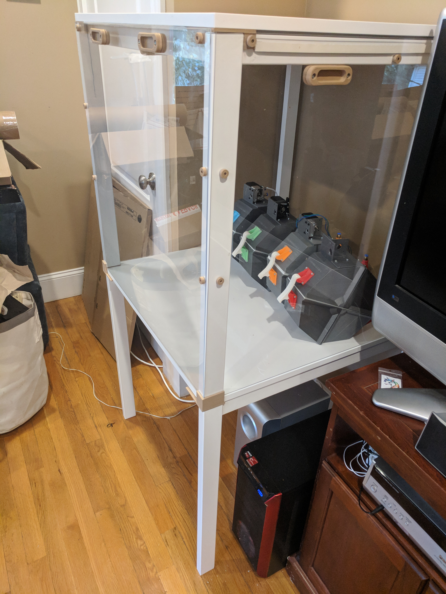

I also added a pair of mounted magnets 8" and 16" down from the top
of the leg, in order to better seal the sides of the plexiglass.
For the side pieces, I added some [foam sealing tape], and superglued
one magnet directly to the table frame.  A mounted magnet glued to
the plexiglass at this same spot helps keep the plexiglass pressed
into the foam tape.

 

### Step 6: Install handles

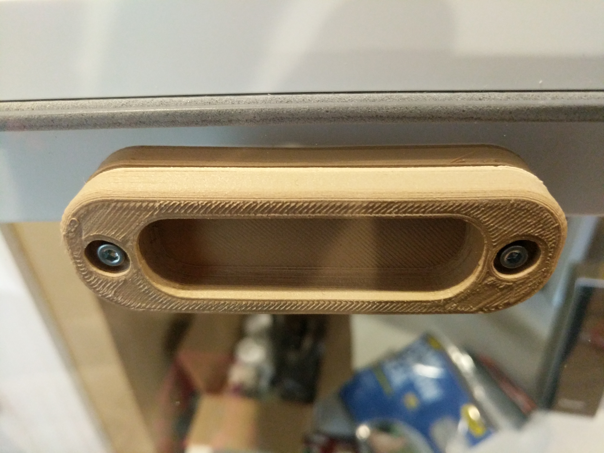

Use M3 x 12mm socket head screws and M3 nuts to attach handles
([`melltorp-handle-top.stl`]) to either side of the plexiglass.
Note that I had some issues with the plexiglass cracking when I
drilled the screw holes for mounting; I recommend supergluing
one side to the plexiglass and then using it as a guide when
drilling.  The glued side would prevent any crack from spreading,
but it also seems to prevent cracking in the first place.

 
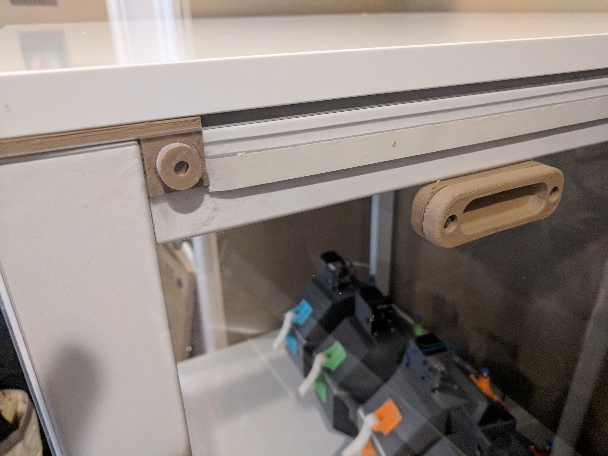

I find it most convenient to have a handle for gripping on both
sides of the plexiglass, so I can easily lift the sheets into
place or out of the way, but if you want to save some printing
time you can glue handles on only one side, or else use
[`melltorp-handle-bottom.stl`] on the back side.

 

## Related

* [An excellent printer enclosure using a Lack table](https://www.thingiverse.com/thing:1843235).

## License

These designs are licensed under the [GPLv2+].

[Lack]: http://www.ikea.com/us/en/catalog/products/20011408/
[Melltorp]: http://www.ikea.com/us/en/catalog/products/S39011781/
[28"x30" plexiglass]: https://www.lowes.com/pd/OPTIX-0-08-in-x-30-in-x-30-in-Clear-Acrylic-Sheet/3978817
[10x3mm magnets]: https://amazon.com/gp/product/B01MFHNHNW/
[foam sealing tape]: https://amazon.com/gp/product/B00005202Y
[`melltorp-above-wrap.stl`]: ./melltorp-stl/melltorp-above-wrap.stl
[`melltorp-above.stl`]: ./melltorp-stl/melltorp-above.stl
[`melltorp-below.stl`]: ./melltorp-stl/melltorp-below.stl
[`melltorp-holder.stl`]: ./melltorp-stl/melltorp-holder.stl
[`melltorp-handle-top.stl`]: ./melltorp-stl/melltorp-handle-top.stl
[`melltorp-handle-bottom.stl`]: ./melltorp-stl/melltorp-handle-bottom.stl
[GPLv2+]: https://spdx.org/licenses/GPL-2.0+.html
